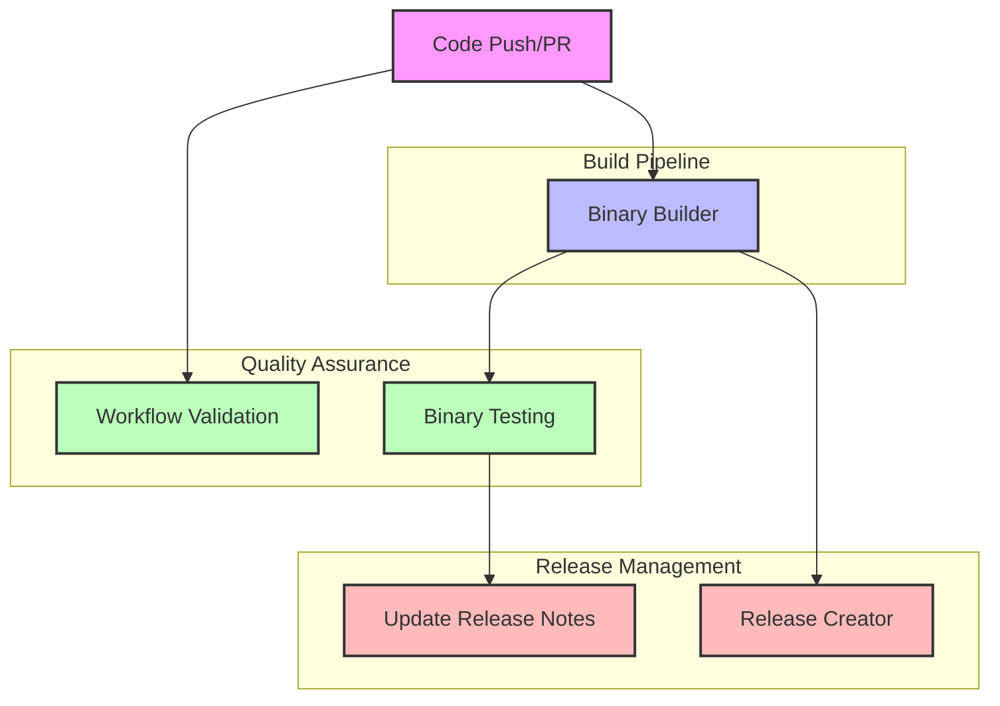

# CI/CD Pipeline Documentation

This documentation provides a comprehensive overview of our GitHub Actions CI/CD pipeline, explaining how the different workflows interact and work together to build, test, and release our software.

## Table of Contents

- [Overview](#overview)
- [Workflow Relationships](#workflow-relationships)
- [Key Components](#key-components)
- [Workflow Documentation](#workflow-documentation)
- [Contributing](#contributing)
- [Glossary of CI/CD Terms](#glossary-of-cicd-terms)

## Overview

Our CI/CD pipeline is designed to automate the process of building, testing, and releasing our software across multiple platforms and architectures. The pipeline consists of four main workflows:

1. **Binary Builder**: Builds binary executables for multiple platforms (Linux, macOS, Windows) and architectures (x64, arm64)
2. **Binary Testing**: Tests the built binaries to ensure they function correctly on each platform
3. **Release Creator**: Creates GitHub releases with the built and tested binaries
4. **Workflow Validation**: Ensures that all workflows follow our security and best practices guidelines

These workflows work together to provide a seamless and automated process from code commit to software release.

## Workflow Relationships

The following diagram illustrates how our workflows interact with each other:

### Workflow Triggers

- **Binary Builder**: Triggered on push to main/development branches or manually
- **Binary Testing**: Triggered after successful completion of Binary Builder
- **Release Creator**: Triggered after successful completion of Binary Builder on the main branch
- **Workflow Validation**: Triggered on pull requests that modify workflow files or manually

### Artifact Flow

1. **Binary Builder** produces binary artifacts for each platform/architecture
2. **Binary Testing** consumes these artifacts to perform tests
3. **Release Creator** also consumes these artifacts to create GitHub releases

## Key Components

Our CI/CD pipeline includes several key components:

### 1. Matrix Builds

We use matrix builds in the Binary Builder workflow to build binaries for multiple platforms and architectures in parallel:
- Linux (x64, arm64)
- macOS (x64, arm64)
- Windows (x64)

### 2. Artifact Management

Artifacts are passed between workflows using GitHub Actions artifacts:
- Binary artifacts are uploaded by the Binary Builder workflow
- These artifacts are downloaded by the Binary Testing and Release Creator workflows

### 3. Release Management

The Release Creator workflow:
- Creates GitHub releases with appropriate version tags
- Attaches binary artifacts to the release
- Generates release notes

### 4. Quality Assurance

Quality is ensured through:
- Binary testing across all supported platforms
- Workflow validation to enforce security best practices
- Automated issue creation for test failures

## Workflow Documentation

Detailed documentation for each workflow:

- [Binary Builder](./binary_builder.md): Building cross-platform binaries
- [Binary Testing](./binary_testing.md): Testing binary functionality
- [Release Creator](./release_creator.md): Creating GitHub releases
- [Workflow Validation](./workflow_validation.md): Ensuring workflow quality and security

## Contributing

For information on how to modify existing workflows or add new ones, see the [Contributing Guide](./contributing.md).

## Glossary of CI/CD Terms

| Term | Definition |
|------|------------|
| **Artifact** | A file or collection of files produced during the build process that is stored for later use, such as compiled binaries or test reports. |
| **CI (Continuous Integration)** | The practice of frequently merging code changes into a shared repository, with automated builds and tests to detect problems early. |
| **CD (Continuous Delivery/Deployment)** | The practice of automatically deploying all code changes to a testing or production environment after the build stage. |
| **GitHub Actions** | GitHub's built-in CI/CD platform that allows automation of software workflows directly in a GitHub repository. |
| **Workflow** | A configurable automated process made up of one or more jobs, defined in YAML files in the `.github/workflows` directory. |
| **Job** | A set of steps in a workflow that execute on the same runner (virtual machine). |
| **Step** | An individual task that can run commands or actions within a job. |
| **Runner** | A server that runs GitHub Actions workflows, either GitHub-hosted or self-hosted. |
| **Action** | A reusable unit of code that can be used in workflows, either from the GitHub Marketplace or custom-built. |
| **Matrix Build** | A strategy that allows running multiple jobs with different configurations in parallel. |
| **Environment Variables** | Variables that are set in the workflow environment and can be used by steps in the workflow. |
| **Secrets** | Encrypted environment variables that are only exposed to selected actions. |
| **Trigger** | An event that causes a workflow to run, such as a push, pull request, or manual dispatch. |
| **Concurrency** | A feature that ensures only one workflow run with the same concurrency group runs at a time. |
| **Permissions** | Controls what actions a workflow can perform, following the principle of least privilege. |
| **Pinned Action** | An action that is referenced by its specific commit SHA rather than a tag, for security purposes. |
| **Timeout** | A limit on how long a job or workflow can run before it is automatically cancelled. |
| **Artifact Retention** | The period of time that artifacts are stored before being automatically deleted. |
| **Self-hosted Runner** | A runner that you host yourself, as opposed to the GitHub-hosted runners. |
| **Workflow Dispatch** | A manual trigger for a workflow. |